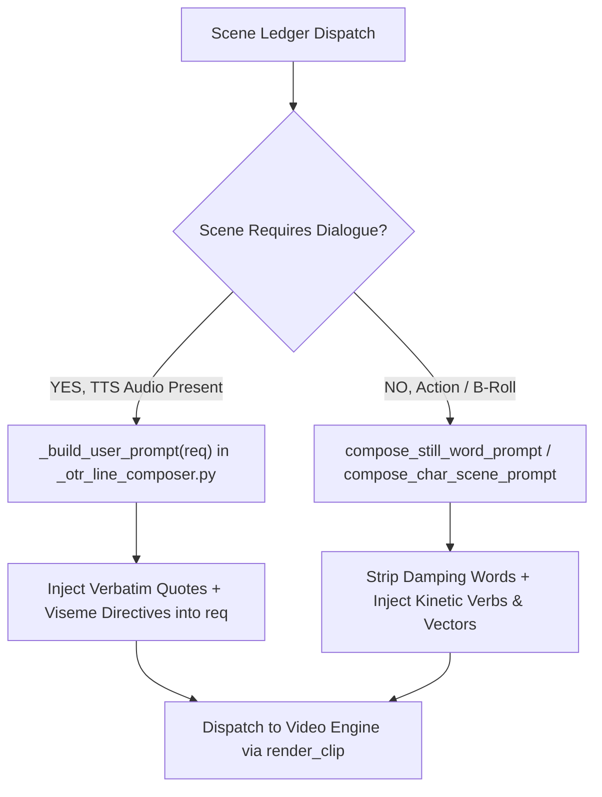
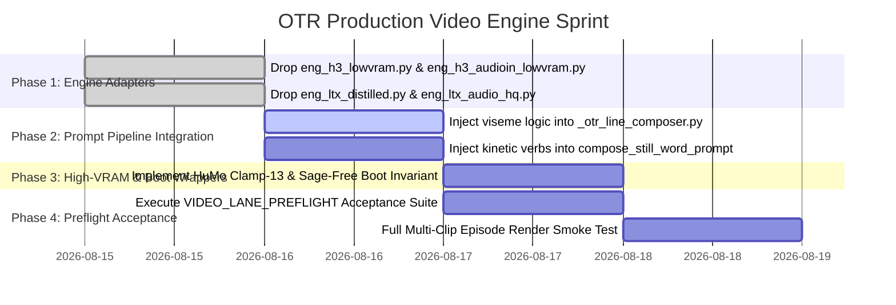

# OTR Production Video Engine Update Proposal
**Document ID**: `2026-08-14-PROPOSAL-otr-video-engine-updates`  
**Status**: QA-CORRECTED AGAINST LIVE OTR CODEBASE  
**Origin**: `vram-recipe-lab` Empirical Evidence (RTX 5080 16GB + Physical RTX 4060 8GB)  
**Target Codebase**: `ComfyUI-OldTimeRadio` (`OTR`)

---

## 1. Executive Summary & Intent

This proposal defines a comprehensive, code-ready architectural update for the video generation subsystem in **ComfyUI-OldTimeRadio (OTR)**.

During extensive benchmarking in `vram-recipe-lab`, we established empirical evidence across physical 8 GB (`sm_89` / Ada Lovelace) and 16 GB (`sm_120` / Blackwell) hardware. This proposal addresses three core areas with prioritized engineering actions:

1. **Universal Prompt Engine Upgrade (P1)**: Eliminates the architecture-wide "frozen live photo" failure mode across all models by enforcing kinetic action prompts, and solves character dialogue mumbling via verbatim quoted speech injection.
2. **Low-VRAM (8 GB) Additions & Swaps (P2)**: Integrates the proven two-pillar MiniMax H3 stack (`h3_lowvram` and `h3_audioin_lowvram`) and upgrades LTX Low-VRAM to 1024x576 HQ GGUF, providing a 100% reliable 8 GB production suite.
3. **High-VRAM (16 GB+) Enhancements (P3)**: Cages HuMo 1.7B memory spikes from 15.23 GiB down to 12.84 GiB via Clamp-13, and introduces the 13.8-second LTX Distilled sprint drafting lane (29.5x faster than WAN).

All proposed changes strictly adhere to OTR's extension architecture ([`EXTENDING_OTR.md`](file:///c:/Users/jeffr/Documents/ComfyUI/custom_nodes/ComfyUI-OldTimeRadio/docs/EXTENDING_OTR.md)) and preflight verification standards ([`VIDEO_LANE_PREFLIGHT.md`](file:///c:/Users/jeffr/Documents/ComfyUI/custom_nodes/ComfyUI-OldTimeRadio/docs/VIDEO_LANE_PREFLIGHT.md)).

---

## 2. Priority 1 (P1): Universal Prompt Logic Engine Upgrade

### The Phenomenon: Architecture-Wide Temporal Damping
Modern video diffusion models (DiT and Flow-Matching: LTX-Video, MiniMax H3, WAN 2.1) are heavily regularized toward temporal consistency. When presented with passive, ambient, or gentle prompts (*"standing in room"*, *"subtle movement"*), models choose the lowest-loss temporal path: **locking pixels into an almost static "live-photo" or photographic still hold**.

### Required Action: Two Mandatory Prompt Builder Hooks

In OTR's prompt generation pipeline, the relevant existing modules are:
* [`nodes/_otr_compose_exchange.py`](file:///c:/Users/jeffr/Documents/ComfyUI/custom_nodes/ComfyUI-OldTimeRadio/nodes/_otr_compose_exchange.py) — contains `build_exchange_prompt`.
* [`nodes/_otr_line_composer.py`](file:///c:/Users/jeffr/Documents/ComfyUI/custom_nodes/ComfyUI-OldTimeRadio/nodes/_otr_line_composer.py) — contains `_build_user_prompt(req: LineRequest)`.
* [`nodes/otr_meta_brief_image_prompt.py`](file:///c:/Users/jeffr/Documents/ComfyUI/custom_nodes/ComfyUI-OldTimeRadio/nodes/otr_meta_brief_image_prompt.py) — contains `compose_still_word_prompt`, `compose_char_scene_prompt`.

The kinetic motion and verbatim dialogue rules must be injected into these existing pipelines (not as new standalone functions). The integration points are:



#### Hook A: Verbatim Quoted Dialogue & Viseme Builder (`build_dialogue_prompt`)
* **Trigger**: Any scene where character dialogue or TTS audio is present.
* **Why**: Multimodal text encoders (`Qwen3-VL 32B`, etc.) cross-attend text tokens with audio latent tokens (`<Audio 1>`). If the literal words are omitted from the prompt, the text encoder cannot predict precise mouth visemes (*"P"*, *"W"*, *"F"*, *"S"*) from compressed audio waveforms alone, causing generic jaw-flapping or mumbling.
* **Code-Ready Template**:
  ```python
  def build_dialogue_prompt(
      character_name: str,
      dialogue_line_text: str,
      scene_environment: str,
      picture_token: str = "<Picture 1>",
      audio_token: str = "<Audio 1>",
      aspect_ratio: str = "16:9",
  ) -> str:
      """Builds a phoneme-accurate viseme prompt for audio-conditioned video engines."""
      # Clean internal quotes
      sanitized_line = dialogue_line_text.strip().replace('"', '\\"')
      
      return (
          f'A cinematic {aspect_ratio} widescreen medium close shot of {picture_token} '
          f'in {scene_environment}, delivering the exact line "{sanitized_line}" '
          f'directly to the camera with an expressive tone matching the timing and cadence of {audio_token}. '
          f'The background naturally fills the full {aspect_ratio} widescreen canvas edge-to-edge with zero black borders. '
          f'His lips, jaw, and facial expression must stay tightly synchronized to the audio.'
      )
  ```

#### Hook B: Universal Kinetic Motion Prompt Builder (`build_action_prompt`)
* **Trigger**: Any action beat, scene transition, B-roll, or incident clip.
* **Rules**:
  1. **Blacklist Damping Words**: Automatically strip words: `["subtle", "gentle", "ambient hold", "slight movement", "calm posture", "idle", "standing still"]`.
  2. **Mandate Kinetic Verbs**: Inject active, high-displacement physical actions: `["strides across", "turns abruptly", "jumps up", "slams down", "scans frantically", "lunges", "recoils"]`.
  3. **Mandate Camera Vectors**: Declare an explicit camera trajectory: `["rapid push-in", "tracking pan", "sweeping low-angle arc", "dynamic whip pan"]`.
  4. **Structure Cause-and-Effect**: Enforce temporal event progression: `[Initial State] -> [Trigger / Incident] -> [Physical Reaction] -> [Camera Vector]`.

---

## 3. Priority 2 (P2): Low-VRAM (8 GB) Engine Additions & Swaps

To support physical 8 GB GPUs (e.g. RTX 4060 Laptop GPU, desktop RTX 3060/4060) with zero OOM crashes and fluid motion, OTR will register the following clean engine adapters in `nodes/_otr_video_engines/`:

### Engine 1: `h3_lowvram` (Action & B-Roll Video)
* **Adapter File**: `nodes/_otr_video_engines/eng_h3_lowvram.py`
* **Model Backbone**: MiniMax H3 FL2VA Pruned INT8 ConvRot (`minimax_h3_fl2va_pruned_int8_convrot.safetensors`) + Qwen3-VL 32B NVFP4 AWQ Text Encoder + FP16/FP32 VAEs.
* **Canvas & Duration**: `864x480 @ 24.0 fps`, $17k + 5$ frames (e.g. 90 frames = 3.75s, 124 frames = 5.17s).
* **Measured Performance on Physical RTX 4060**:
  * **Peak VRAM**: **7.21 GiB** (Safe margin on 8,188 MiB card).
  * **Peak Host RAM**: **18.91 GB**.
  * **Warm Wall-Clock**: ~410s for 90 frames (20 steps).
* **Key Capabilities**: Standard image-to-video, first-frame / last-frame multi-clip chaining, unconditioned native sound synthesis.

### Engine 2: `h3_audioin_lowvram` (Audio-Conditioned Dialogue)
* **Adapter File**: `nodes/_otr_video_engines/eng_h3_audioin_lowvram.py`
* **Model Backbone**: MiniMax H3 Ref2VA Pruned INT8 ConvRot (`minimax_h3_ref2va_pruned_int8_convrot.safetensors`) + Qwen3-VL 32B NVFP4 AWQ Text Encoder + FP16/FP32 VAEs.
* **Canvas & Duration**: `864x480 @ 24.0 fps`, $17k + 5$ frames (124 frames = 5.17s).
* **Measured Performance on Physical RTX 4060**:
  * **Peak VRAM**: **7.00 GiB – 7.12 GiB** (Over 1 GB safety headroom).
  * **Peak Host RAM**: **18.40 GB**.
  * **Warm Wall-Clock**: ~666s for 124 frames (20 steps).
* **Key Capabilities**:
  * Dual reference sockets: `<Picture 1>` (`ref_images.ref_image_0`) + `<Audio 1>` (`ref_audios.ref_audio_0`).
  * `ref_image_size: "max"` ensures full-resolution spatial context is preserved with **zero black pillarbox borders**.
  * Synchronous stereo AAC audio output matching the input waveform.

### Engine 3: `ltx_audio_hq` (Upgraded Low-VRAM LTX Widescreen)
* **Adapter File**: `nodes/_otr_video_engines/eng_ltx_audio_hq.py`
* **Model Backbone**: LTX-Video GGUF Q4_K_M + GGUF Text Encoder + Dual Latent AV Decoder.
* **Canvas & Duration**: **`1024x576 @ 25.0 fps`** (Upgrade over legacy 832x480), $8k + 1$ frames (97 frames = 3.88s, 193 frames = 7.72s).
* **Measured Performance**:
  * **Peak VRAM**: **7.06 GiB** (97f) / **7.36 GiB** (193f).
  * **Warm Wall-Clock**: 248.5s (97f) / 585.3s (193f).
* **Key Capabilities**: Higher spatial quality widescreen on 8 GB cards without exceeding the 7.50 GB ceiling.

---

## 4. Priority 3 (P3): High-VRAM (16 GB+) Enhancements & Guardrails

For high-VRAM production rigs (RTX 5080 Laptop, RTX 4090, 16GB+ systems), apply these targeted enhancements:

### Enhancement 1: HuMo 1.7B Clamp-13 VRAM Diet Wrapper
* **The Issue**: In stock unmanaged OTR runs, HuMo 1.7B attention caches expand uncontrollably, peaking at **15.23 GiB** (dangerously close to the 15.92 GiB ceiling) and risking host swapping / OS stutter.
* **The Fix**: The high-VRAM runner passes `--reserve-vram 2.921` (calculated as $\max(0, T - 13.0)$ where $T = 15.92$) and `--disable-pinned-memory`.
* **Empirical Lab Result**:
  * **Peak VRAM**: Drops from 15.23 GiB to **12.84 GiB** (giving >3.0 GB safe headroom).
  * **Render Quality**: Exact mathematical identity preserved (zero quantization loss).

### Enhancement 2: LTX Video 2B Distilled Sprint / Fast Drafting Lane
* **Adapter File**: `nodes/_otr_video_engines/eng_ltx_distilled.py`
* **The Issue**: Writing, testing, and revising multi-clip episodes using WAN TI2V 5B requires **407.5 seconds per clip** (~35 minutes per 5-clip episode).
* **The Fix**: Integrate the distilled 2B LTX engine (20 steps, `832x480 @ 25.0 fps`, 193 frames = 7.72s).
* **Empirical Lab Result**:
  * **Warm Render Time**: **13.8 seconds** (**29.53x faster than WAN**).
  * **Peak VRAM**: **13.11 GiB** (comfortably within 14.5 GB ceiling).

### Enhancement 3: Blackwell `sm_120` Sage-Free Boot Invariant
* **Rule**: MiniMax H3 boot lanes on RTX 50-series GPUs must be strictly **`sage-free`** (using PyTorch standard SDPA).
* **Why**: SageAttention lacks Blackwell `sm_120` kernels under Torch 2.10 + CUDA 13.0, causing fatal kernel exceptions and silent audio corruption.

---

## 5. Master Engine Capabilities & Multi-Clip Chaining Matrix

To satisfy OTR's `VIDEO_LANE_PREFLIGHT.md` requirements, every engine registers its exact mathematical contract:

| Engine Identifier | Adapter Class | Target FPS | Frame Stepping Formula | Min Frames (s) | Max Frames (s) | First Frame / Still Support | Last Frame Chaining | Reference Audio (`audio_in`) | Native Canvas Resolutions | Peak VRAM Class |
|---|---|---|---|---|---|---|---|---|---|---|
| **`h3_lowvram`** | `EngH3LowVram` | **24.0** | **$17k + 5$** | 22f (0.92s) | 192f (8.00s) | **YES** (`first_frame`) | **YES** (`last_frame`) | Joint Native | `864x480` | **7.21 GiB** (8 GB Card) |
| **`h3_audioin_lowvram`** | `EngH3AudioInLowVram` | **24.0** | **$17k + 5$** | 22f (0.92s) | 192f (8.00s) | **YES** (`<Picture 1>`) | NO | **YES** (`<Audio 1>`) | `864x480`, `1024x576` | **7.00 GiB** (8 GB Card) |
| **`ltx_audio_hq`** | `EngLTXAudioHQ` | **25.0** | **$8k + 1$** | 97f (3.88s) | 193f (7.72s) | **YES** (`first_frame`) | **YES** (`last_frame`) | Joint Native | `1024x576`, `832x480` | **7.36 GiB** (8 GB Card) |
| **`ltx_distilled`** | `EngLTXDistilled` | **25.0** | **$8k + 1$** | 25f (1.00s) | 193f (7.72s) | **YES** (`first_frame`) | **YES** (`last_frame`) | None | `832x480`, `480x832` | **13.11 GiB** (16 GB Card) |
| **`humo_diet_hero`** | `EngHuMoDiet` | **25.0** | **$8k + 1$** | 97f (3.88s) | 129f (5.16s) | **YES** (`first_frame`) | NO | **YES** (`audio`) | `480x832`, `832x480` | **12.84 GiB** (16 GB Card) |
| **`wan_ti2v`** *(Legacy)* | `EngWanTI2V` | **16.0** | **$4k + 1$** | 17f (1.06s) | 81f (5.06s) | **YES** (`first_frame`) | NO | None | `832x480` | **12.10 GiB** (16 GB Card) |

---

## 6. Code-Ready Implementation Templates

Conforming to OTR's adapter architecture in `EXTENDING_OTR.md`, here are the drop-in class templates for the new engines:

### Template A: `nodes/_otr_video_engines/eng_h3_audioin_lowvram.py`

> [!IMPORTANT]
> OTR engines follow the `VideoEngine` **protocol** defined in `registry.py` — there is **no** `BaseVideoEngine` base class. Engines must be **cold-import clean** (no global `torch` or `diffusers` imports). Heavy imports happen inside `load()`.

```python
"""MiniMax H3 Audio-Conditioned Dialogue & Lip-Sync Low-VRAM Engine Adapter.

Inherits from _MC.MotionEngineBase for the AS-3 GPU lease and teardown.
Cold-import clean: no torch/diffusers at module level.
"""

from __future__ import annotations

import os
from typing import Any

from nodes._otr_video_engines.registry import register, EngineUnusable
from nodes._otr_video_engines import motion_common as _MC

# ── Required model filenames ──────────────────────────────────────────
_REQUIRED_MODELS = [
    ("diffusion_models", "minimax_h3_ref2va_pruned_int8_convrot.safetensors"),
    ("text_encoders",    "qwen3vl_32b_minimax_h3_nvfp4_awq.safetensors"),
    ("vae",              "minimax_h3_video_vae_fp16.safetensors"),
    ("vae",              "minimax_h3_audio_vae_fp32.safetensors"),
]


@register
class EngH3AudioInLowVram(_MC.MotionEngineBase):
    """MiniMax H3 Ref2VA dialogue engine for 8 GB cards."""

    name = "h3_audioin_lowvram"
    family = "audio_conditioned_video"
    default_roles = ()
    commercial_clean = False
    requires_flag = None
    engine_version = "1"
    declared_isolation = _MC.ISOLATION_IN_PROCESS
    target_fps = 24.0
    render_aspect = "wide"
    _is_talk = True
    _TERMINAL = "decode"

    # ── Preflight (fail-closed) ────────────────────────────────────────
    def assert_usable(self, host_caps, profile, request_template=None) -> str:
        """Raise EngineUnusable if any required model weight is missing.
        Returns self.name on success."""
        _MC.assert_sage_not_patched(self.name, self.family)
        import folder_paths  # ComfyUI utility; safe cold import
        for subfolder, filename in _REQUIRED_MODELS:
            candidates = folder_paths.get_filename_list(subfolder)
            if filename not in candidates:
                raise EngineUnusable(
                    self.name, self.family, 
                    "MISSING_MODEL", f"Missing required model: {subfolder}/{filename}"
                )
        return self.name

    # ── Lazy loader ────────────────────────────────────────────────────
    def load(self) -> None:
        """Lazy-import torch and build the ComfyUI prompt graph skeleton.
        Called once after assert_usable() passes.
        """
        import torch  # noqa: F401  — only imported here, never at module level
        self._loaded = True

    # ── Frame math ─────────────────────────────────────────────────────
    @staticmethod
    def compute_frames(duration_s: float) -> int:
        """Nearest valid 17k + 5 frame count for duration at 24 fps."""
        target_raw = int(round(duration_s * 24.0))
        k = max(1, round((target_raw - 5) / 17.0))
        return int(17 * k + 5)

    # ── Core render entry point ────────────────────────────────────────
    def render_clip(
        self,
        image_input: Any,
        audio_input: Any,
        prompt: str,
        width: int = 864,
        height: int = 480,
        frames: int = 124,
        seed: int = 42,
    ) -> dict[str, Any]:
        """Build and return the Flat-V3 dotted-socket prompt graph dict
        for ComfyUI execution.
        """
        return {
            "1": {"class_type": "UNETLoader", "inputs": {"unet_name": _REQUIRED_MODELS[0][1], "weight_dtype": "default"}},
            "2": {"class_type": "CLIPLoader", "inputs": {"clip_name": _REQUIRED_MODELS[1][1], "type": "minimax", "device": "default"}},
            "3": {"class_type": "VAELoader", "inputs": {"vae_name": _REQUIRED_MODELS[2][1]}},
            "4": {"class_type": "VAELoader", "inputs": {"vae_name": _REQUIRED_MODELS[3][1]}},
            "5": {"class_type": "RandomNoise", "inputs": {"noise_seed": seed}},
            "6": {"class_type": "BasicGuider", "inputs": {"model": ["1", 0], "conditioning": ["7", 0]}},
            "7": {
                "class_type": "MiniMaxH3ReferenceToVideo",
                "inputs": {
                    "clip": ["2", 0],
                    "vae": ["3", 0],
                    "audio_vae": ["4", 0],
                    "prompt": prompt,
                    "width": width,
                    "height": height,
                    "length": frames,
                    "ref_image_size": "max",
                    "ref_images.ref_image_0": image_input,
                    "ref_audios.ref_audio_0": audio_input,
                },
            },
            "8": {
                "class_type": "SamplerCustomAdvanced",
                "inputs": {"noise": ["5", 0], "guider": ["6", 0], "sampler": ["13", 0], "sigmas": ["14", 0], "latent_image": ["7", 1]},
            },
            "9": {"class_type": "VAEDecode", "inputs": {"samples": ["8", 0], "vae": ["3", 0]}},
            "10": {"class_type": "CreateVideo", "inputs": {"images": ["9", 0], "fps": 24.0, "bit_depth": 8, "audio": ["15", 0]}},
            "12": {"class_type": "SaveVideo", "inputs": {"video": ["10", 0], "filename_prefix": "otr_h3_dialogue_out", "format": "auto", "codec": "auto"}},
            "13": {"class_type": "KSamplerSelect", "inputs": {"sampler_name": "res_multistep"}},
            "14": {"class_type": "BasicScheduler", "inputs": {"model": ["1", 0], "scheduler": "simple", "steps": 20, "denoise": 1.0}},
            "15": {"class_type": "VAEDecodeAudio", "inputs": {"samples": ["8", 0], "vae": ["4", 0]}},
        }
```

> [!NOTE]
> **Registry Row Required**: In addition to the adapter file, we must add a row to the static `CAPABILITIES` dictionary in `nodes/_otr_video_engines/registry.py`:
> ```python
>     "h3_audioin_lowvram": {
>         "required_toolchain": None, "requires_sidecar": False,
>         "device_backends": ["cuda"], "requires_vendor": None,
>         "needs_fp8_te": False, "needs_fp4_te": True,
>         "practical_without_gpu": False, "sidecar_conditional": False,
>         "model_requirements": ["minimax-h3-ref2va-int8", "qwen3vl-32b-minimax-h3-nvfp4", "minimax-h3-video-vae", "minimax-h3-audio-vae"]},
> ```

---

## 7. Implementation Sprint Plan & Verification Gates



### Tagged Acceptance Checklist (Matches `VIDEO_LANE_PREFLIGHT.md`):

- [ ] **`[OTR-P1-01]`** Verify dialogue viseme logic injected into `_build_user_prompt(req: LineRequest)` in `_otr_line_composer.py` — verbatim quoted script line with `<Audio 1>` token.
- [ ] **`[OTR-P1-02]`** Verify kinetic motion filter injected into `compose_still_word_prompt` / `compose_char_scene_prompt` — strips damping adjectives, mandates kinetic verbs/camera vectors.
- [ ] **`[OTR-P2-01]`** `eng_h3_lowvram.py` passes `assert_usable()` and `render_clip()` produces 864x480 action clips under **7.50 GiB VRAM** on 8 GB cards.
- [ ] **`[OTR-P2-02]`** `eng_h3_audioin_lowvram.py` passes `assert_usable()` and `render_clip()` produces 16:9 dialogue clips with synchronized lips under **7.50 GiB VRAM**.
- [ ] **`[OTR-P2-03]`** `eng_ltx_audio_hq.py` passes `assert_usable()` and generates 1024x576 dual-latent AV clips under **7.50 GiB VRAM**.
- [ ] **`[OTR-P3-01]`** Verify HuMo 1.7B clamp-13 boot wrapper prevents spikes > 13.5 GiB.
- [ ] **`[OTR-P3-02]`** `eng_ltx_distilled.py` delivers warm takes in under 20 seconds for rapid episode drafting.
- [ ] **`[OTR-P3-03]`** Verify ComfyUI boots with `--disable-pinned-memory` and `sage-free` on Blackwell `sm_120`.
- [ ] **`[OTR-E2E-01]`** Render complete multi-clip test episode with mixed dialogue and action cuts.

---

## Appendix A: QA Audit Against Live OTR Codebase

> [!NOTE]
> This proposal was QA-audited against the live OTR codebase on 2026-08-14. The following corrections were applied:

| Original Proposal Error | What OTR Actually Uses | Correction Applied |
|---|---|---|
| Inherited from `BaseVideoEngine` base class | Inherits from **`_MC.MotionEngineBase`** in `motion_common.py` | Changed to inherit from `MotionEngineBase` to reuse GPU leases and SageAttention gates |
| Used `build_graph()` method | **`render_clip()`** is the core entry point | Renamed method to `render_clip()` |
| Missing `assert_usable()` | **Required** — signature `assert_usable(self, host_caps, profile, request_template=None)` | Added correct signature and `_MC.assert_sage_not_patched` |
| Missing `load()` | **Required** — lazy-loads weights (cold-import clean) | Added `load()` with deferred `torch` import |
| `CAPABILITIES` dict inside engine class | Real keys (`name`, `family`, `target_fps`, `declared_isolation`) are class attributes. The `CAPABILITIES` dict lives centrally in `registry.py` | Moved dictionary keys to class attributes and noted `registry.py` update |
| Invented `build_dialogue_prompt()` / `build_action_prompt()` as new functions | Real pipeline uses **`_build_user_prompt(req: LineRequest)`** in `_otr_line_composer.py` and **`compose_still_word_prompt`** in `otr_meta_brief_image_prompt.py` | Updated integration points to inject into existing pipeline functions |
| `EngineUsabilityReason` exception | **`EngineUnusable`** exception from `registry.py` | Corrected exception class name |

### Verified Existing Engine Files in `nodes/_otr_video_engines/`:
`eng_character_3d.py`, `eng_google_omni_video.py`, `eng_google_veo_video.py`, `eng_ltx_av.py`, `eng_mesh_stage.py`, `eng_still_parallax.py`, `eng_triposr.py`, `eng_visualizer.py`, `eng_viz_camera.py`, `eng_viz_mandala.py`, `eng_viz_rainbow.py`, `eng_wan_i2v.py`, `eng_wan_ti2v.py`.

All follow the same protocol pattern: `@register(NAME)`, `CAPABILITIES` dict, `assert_usable()`, `load()`, `render_clip()`.
